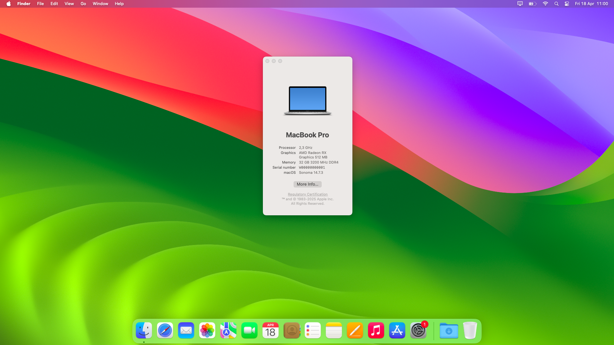
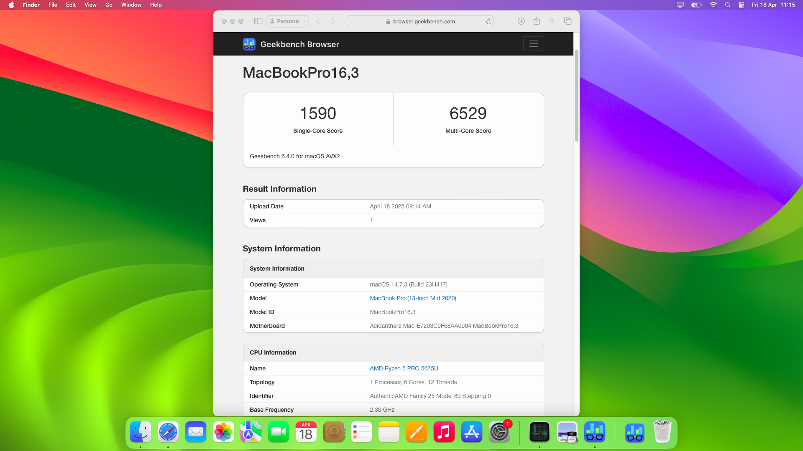
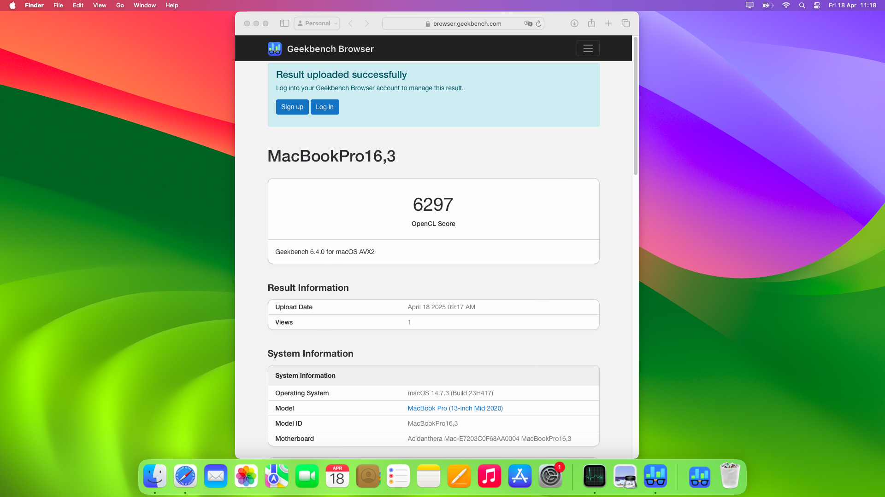
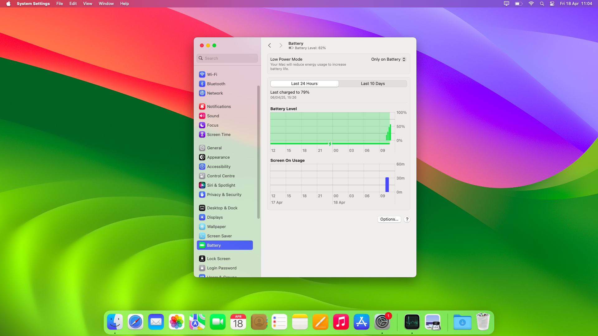
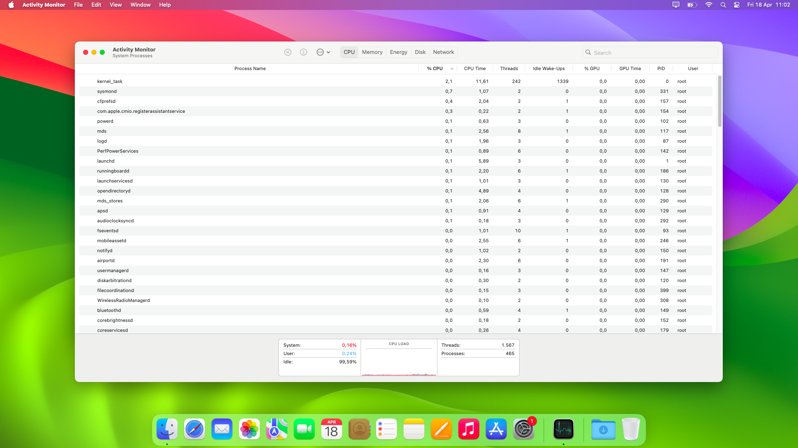
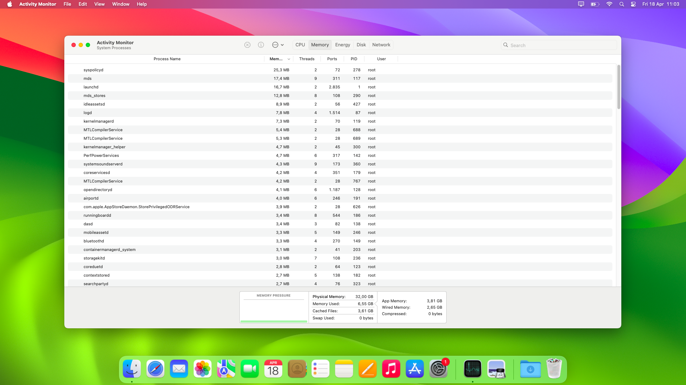
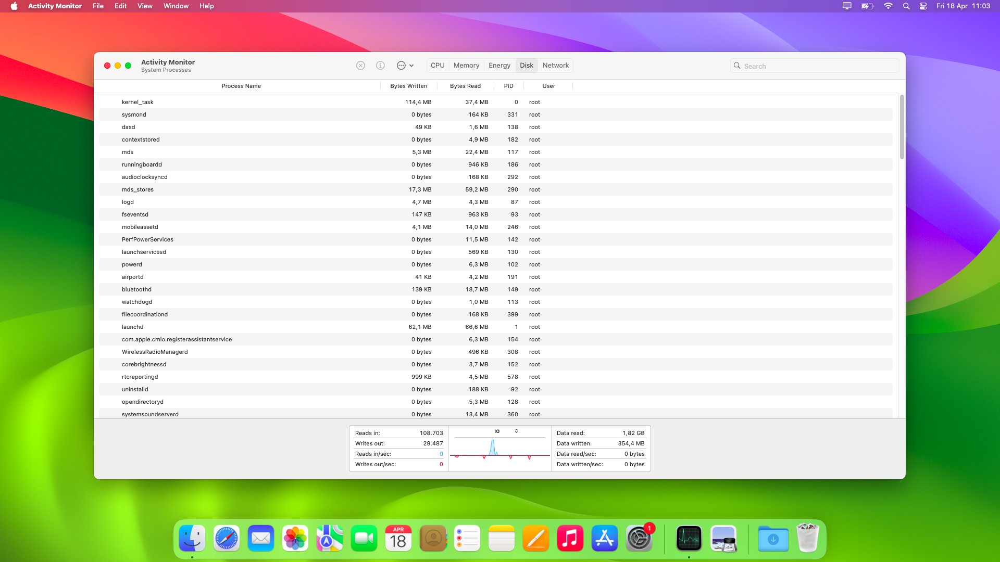

# EliteBook-645-G9-OpenCore
HP EliteBook 645 G9 Hackintosh with OpenCore configuration.

## Tested Operating Systems:
- MacOS Sonoma 14.7.3
- MacOS Sequoia 15.3.1 (WiFi works only with Heliport)

## Hardware configuration:
- **CPU** AMD Ryzen 5 5675U
- **RAM** 32GB DDR4 3200MHz
- **GPU** Integrated AMD Radeon RX (512MB VRam)
- **SSD** Western Digital SN730 512GB
- **Display** Full HD Touchscreen Display (1920x1080)
- **Ethernet** Realtek RTL8168 Gigabit Ethernet
- **WiFi** 
- **No fingerprint sensor**

## What works:
- Trackpad with gestures
- Touchscreen with gestures
- Keyboard with fn keys
- Ethernet
- Wi-Fi
- Bluetooth
- Speakers and AUX output
- Microphone
- USB A and USB C ports
- Battery percentage
- HDMI
- Sleep / Wake-up

## What doesn't works:
- HP IR/UVC Camera
- Hardware optimisation
- Third party apps

## Points to work on:
- Stability improvements (due to AMD compatibility problems)
- Camera fixes
- Hardware/Battery efficiency

## Screenshots:

